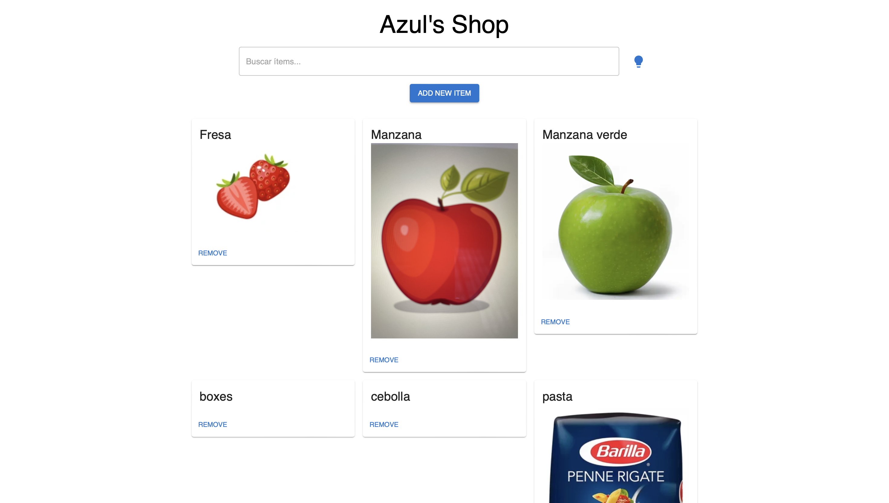
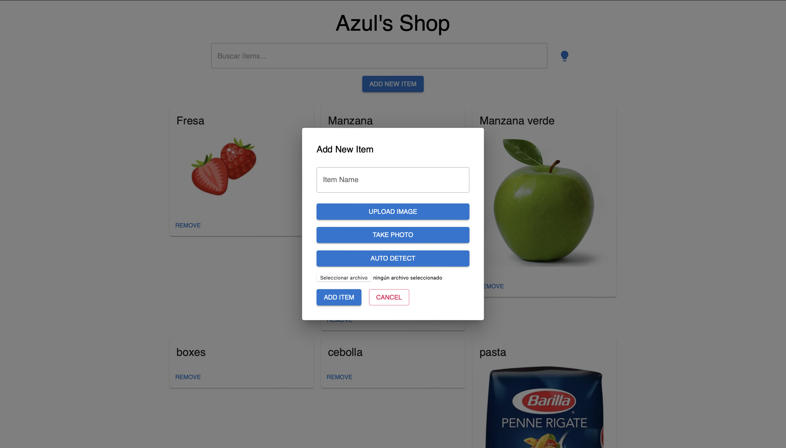

# 🛒 Azul's Shop – AI-Powered Inventory Manager

Azul's Shop is a smart inventory management application built with **React** and **Material-UI**, designed to help users keep track of ingredients while leveraging **AI-powered features**.  
You can add items, delete them, detect ingredients automatically from images using Google Vision, and even get recipe suggestions using OpenAI.

---

## ✨ Features

### 🧾 Inventory Management
- Add, delete, and browse items in your inventory.
- View item details including images and automatically detected labels.

### 📸 Smart Image Upload
- Upload images or capture photos directly using your device camera.
- Automatic image recognition via **Google Cloud Vision API** to detect ingredient names.

### 🍳 AI Recipe Suggestions
- One-click recipe recommendations using the **OpenAI API**, based on the ingredients you currently have.

### 🔍 Fast Search
- Quickly filter items in real time with a built-in search bar.

---

## 🖼 Preview

### Main Screen


### Add Item Modal


---

## 🧰 Tech Stack

- **React** – UI development  
- **Material-UI** – Component styling  
- **Firebase** – Storage + database  
- **Google Vision API** – Ingredient/image detection  
- **OpenAI API** – Recipe generation  

---

## ⚙️ Installation

### 1. Clone the repository
```bash
git clone https://github.com/AzulRK22/inventory.git
cd inventory
```

### 2. Install dependencies
```bash
npm install
```

### 3. Configure environment variables  
Create a **.env.local** file:

```
NEXT_PUBLIC_API_URL=your_api_url
NEXT_PUBLIC_GOOGLE_VISION_API_KEY=your_google_vision_api_key
NEXT_PUBLIC_OPENAI_API_KEY=your_openai_api_key
```

### 4. Run the development server
```bash
npm run dev
```

Open the app at:  
➡️ http://localhost:3000

---

## 🚀 Usage

### 🔍 Search Items  
Filter items dynamically as you type.

### ➕ Add Items  
- Click **Add New Item**
- Upload an image or capture a photo  
- (Optional) Let Google Vision auto-detect the ingredient  

### 🗑 Delete Items  
Remove items with a single click.

### 💡 Get Recipe Suggestions  
Click the **lightbulb icon** to generate AI-powered recipe ideas based on your current ingredients.

---

## 📁 Project Structure

```
inventory/
├── app/ or pages/          # Main UI logic (depending on version)
├── components/             # Reusable UI components
├── images/                 # App screenshots
├── firebase.js             # Firebase config
├── public/                 # Static assets
└── README.md
```

---

## 🤝 Contributions

Contributions are welcome!  
Feel free to open an issue or submit a pull request.

---

## 📄 License
This project is licensed under the **MIT License**.

---

## 📬 Contact
Portfolio: https://www.azulrk.com  
GitHub: https://github.com/AzulRK22
