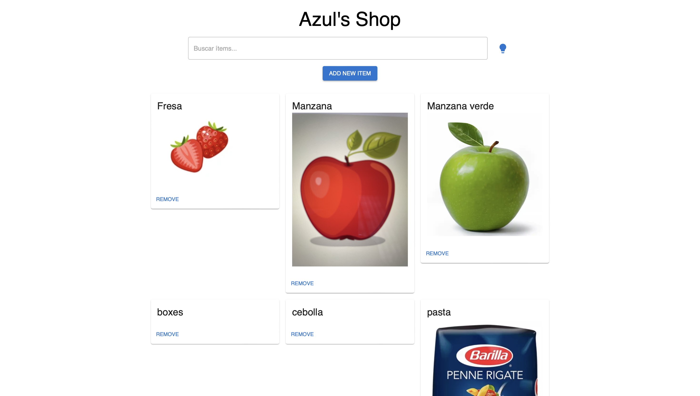
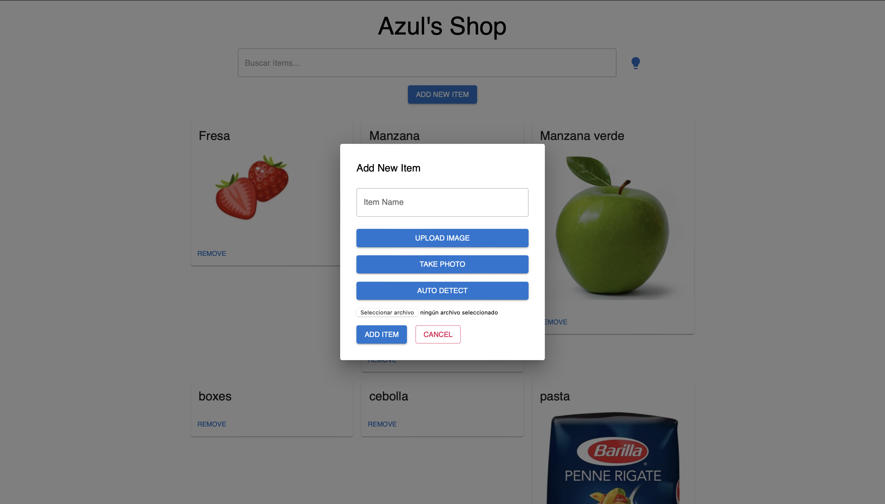

# Azul's Shop

Azul's Shop es una aplicación de gestión de inventario construida con React y Material-UI, que permite a los usuarios agregar, eliminar y buscar ítems en su inventario, así como obtener sugerencias de recetas basadas en los ingredientes disponibles.

## Vista Previa

Aquí hay un par de imágenes de vista previa de la aplicación:


*Vista Previa de la Pantalla Principal*


*Vista Previa del Modal de Agregar Ítem*


## Funcionalidades

- **Gestión de Inventario**: Agrega, elimina y visualiza ítems del inventario.
- **Carga de Imágenes**: Permite subir imágenes de ítems o tomar fotos directamente desde la cámara.
- **Detección Automática de Imágenes**: Usa la API de Google Cloud Vision para detectar automáticamente el nombre del ítem desde una imagen.
- **Sugerencias de Recetas**: Obtén sugerencias de recetas basadas en los ingredientes en tu inventario usando la API de OpenAI.

## Tecnologías

- **React**: Biblioteca para construir la interfaz de usuario.
- **Material-UI**: Componentes de interfaz de usuario estilizados.
- **Firebase**: Utilizado para el almacenamiento en la nube y la base de datos.
- **Google Cloud Vision API**: Para la detección de etiquetas en imágenes.
- **OpenAI API**: Para sugerencias de recetas.

## Instalación

1. Clona el repositorio:
   ```bash
   git clone https://github.com/AzulRK22/inventory.git
2. Navega al directorio del proyecto
   cd inventory
3. Instala las dependencias:
   npm install
4. Configura las variables de entorno. Crea un archivo .env.local en la raíz del proyecto con el siguiente contenido:
    NEXT_PUBLIC_API_URL=your_api_url
    NEXT_PUBLIC_GOOGLE_VISION_API_KEY=your_google_vision_api_key
    NEXT_PUBLIC_OPENAI_API_KEY=your_openai_api_key
5. Inicia el servidor de desarrollo:
   npm run dev
   Abre http://localhost:3000 en tu navegador para ver la aplicación en acción.

## Uso

Buscar Ítems: Utiliza el campo de búsqueda para filtrar los ítems en el inventario.
Agregar Ítems: Haz clic en "Add New Item" para abrir el modal y agregar un nuevo ítem. Puedes subir una imagen, tomar una foto o usar la detección automática de imágenes.
Eliminar Ítems: Haz clic en "Remove" en cualquier tarjeta de ítem para eliminarlo del inventario.
Obtener Sugerencias de Recetas: Haz clic en el icono de bombilla para obtener sugerencias de recetas basadas en los ítems en el inventario.

## Estructura del Proyecto

pages/index.js: Componente principal que maneja la lógica de la aplicación.
firebase.js: Configuración de Firebase.
components/: Componentes reutilizables.

## Contribuciones

Las contribuciones son bienvenidas. Si deseas contribuir, por favor abre un issue o un pull request con tus cambios.

## Licencia

Este proyecto está licenciado bajo la Licencia MIT. Consulta el archivo LICENSE para más detalles.

## Contacto

Si tienes alguna pregunta, no dudes en contactarme a través de mi página web https://www.azulrk.com

Este archivo `README.md` cubre la configuración inicial, el uso de la aplicación y detalles adicionales sobre las tecnologías utilizadas y cómo contribuir. ¡Espero que te sea útil!


