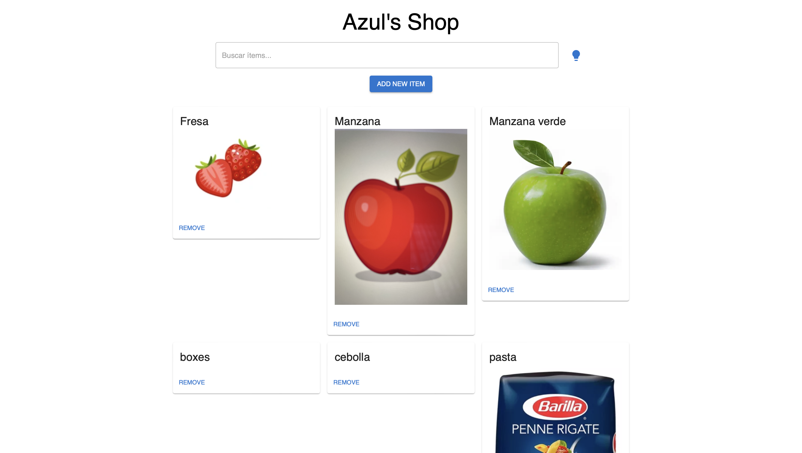
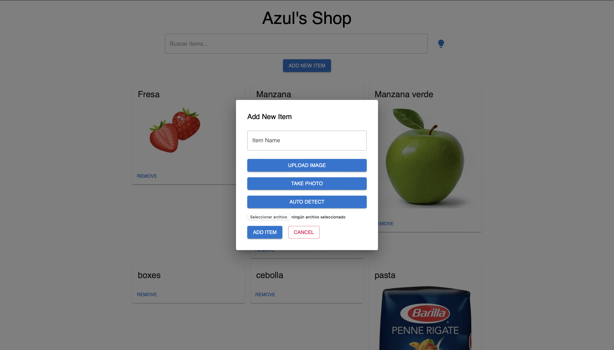

# Azul's Shop

Azul's Shop is an AI-assisted inventory manager built with Next.js, React, and Material UI. It helps users track products with images, adjust quantities, search inventory, detect products from photos, and generate recipe suggestions from current stock.

## Features

- Inventory management with quantity controls and product images
- Smart image upload from local files or camera capture
- Automatic product detection through a secure Google Cloud Vision server route
- Recipe suggestions generated through a secure OpenAI server route
- Search and form validation for empty names, duplicates, and invalid images

## Preview

### Main Screen


### Add Item Modal


## Tech Stack

- Next.js App Router
- React
- Material UI
- Firebase Firestore and Storage
- Google Cloud Vision API
- OpenAI API
- ESLint

## Installation

### 1. Clone the repository

```bash
git clone https://github.com/AzulRK22/inventory.git
cd inventory
```

### 2. Install dependencies

```bash
npm install
```

### 3. Configure environment variables

Create a `.env.local` file in the project root:

```bash
NEXT_PUBLIC_FIREBASE_API_KEY=your_firebase_api_key
NEXT_PUBLIC_FIREBASE_AUTH_DOMAIN=your_firebase_auth_domain
NEXT_PUBLIC_FIREBASE_PROJECT_ID=your_firebase_project_id
NEXT_PUBLIC_FIREBASE_STORAGE_BUCKET=your_firebase_storage_bucket
NEXT_PUBLIC_FIREBASE_MESSAGING_SENDER_ID=your_firebase_sender_id
NEXT_PUBLIC_FIREBASE_APP_ID=your_firebase_app_id
NEXT_PUBLIC_FIREBASE_MEASUREMENT_ID=your_firebase_measurement_id
OPENAI_API_KEY=your_openai_api_key
OPENAI_MODEL=gpt-4o-mini
```

Google Cloud Vision should be configured on the server with Application Default Credentials or your hosting provider's credential mechanism.

### 4. Run the development server

```bash
npm run dev
```

Open the app at `http://localhost:3000`.

## Usage

- Search items with the top search bar
- Add products from the modal with upload, camera, or auto-detection
- Increase or decrease quantities from each inventory card
- Generate recipe suggestions with the lightbulb button

## Project Structure

- `app/page.js`: Main inventory UI and client interactions
- `app/api/vision/route.js`: Secure server route for image label detection
- `app/api/recipes/route.js`: Secure server route for OpenAI recipe suggestions
- `firebase.js`: Firebase configuration
- `public/`: Static assets

## Contributions

Contributions are welcome through issues and pull requests.

## Contact

- Portfolio: https://www.azulrk.com
- GitHub: https://github.com/AzulRK22
